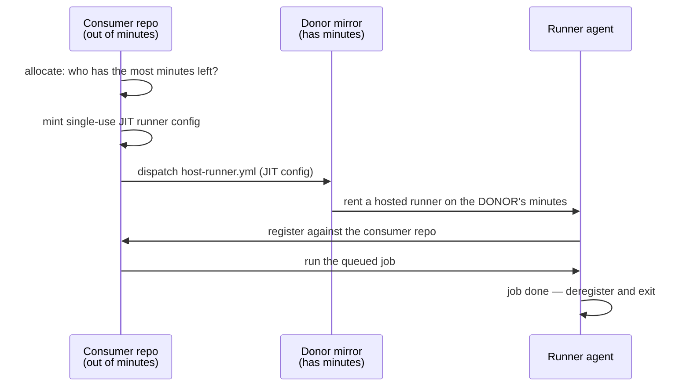

# Free Action Minutes Pool

A minimal, working template for pooling GitHub Actions **included minutes**
across accounts you control. A repo that has run out of free minutes borrows
a runner from an account that still has some, runs its job there, and gives
the runner back.

Everything here is the mechanism and nothing else — no application code — so
you can read it in one sitting, run its tests on a laptop, and lift it into a
real repo.



The trick is that a runner is registered against the repo whose *job* it
runs, but the machine is rented by whoever *starts* it. Start the runner from
an account with spare allowance and the minutes come out of that account's
budget, while the job — and its logs, secrets, and artifacts — stay in the
consumer repo.

## What's here

| Path | Role |
| --- | --- |
| `.github/pool.json` | Donor list, reserve floor, runner wait timeout |
| `.github/scripts/pool/lib.sh` | API wrapper + credential seam |
| `.github/scripts/pool/allocate.sh` | Picks a donor, mints JIT config, dispatches, waits |
| `.github/scripts/pool/sync.sh` | Keeps mirrors identical and correctly enabled |
| `.github/scripts/pool/selftest.sh` | Offline tests for every allocator decision |
| `.github/workflows/pool-allocate.yml` | Reusable allocator job |
| `.github/workflows/host-runner.yml` | Donor side — hosts one runner, one job |
| `.github/workflows/pool-sync.yml` | Daily mirror sync |
| `.github/workflows/demo.yml` | Borrows a runner and reports where it ran |
| `.github/workflows/test.yml` | shellcheck + the offline suite |
| `scripts/gam.sh` | Standalone minute check — the billing query the allocator ranks with |

## Setup

You need two accounts: a **home** account owning this repo, and one or more
**donor** accounts with unused included minutes.

**1. Fork this repo into each donor account.** The donor's copy must be a fork
or mirror of the consumer — see [Terms of service](#terms-of-service) below,
this is not incidental. Name it whatever you like.

**2. Create a classic PAT** that can reach every participating account:

| Scope | Why |
| --- | --- |
| `repo` | mint JIT runner configs on the consumer; push to the mirrors |
| `workflow` | dispatch and cancel `host-runner.yml` in mirrors |
| `read:org` (org donors) / `user` (personal donors) | read the billing usage summary |

**Classic, not fine-grained** — for a pool spanning more than one account.
`POOL_PAT` is used as one credential for the consumer *and* every donor,
while a fine-grained PAT is scoped to a single resource owner, so on a
multi-owner pool it fails against every account but one. A fine-grained token
works only when every participant lives under the same owner; it then needs
Administration → read & write (JIT configs), Actions → read & write (dispatch
and cancel), Contents → read & write (the mirror push), and the billing read
for the account type — *Account Plan: read* for a user, *Organization
Administration: read* for an org.

The billing read is optional. Without it — or without `included_minutes` in
the config below — an account ranks as *unknown*: the allocator still lends,
it just cannot order donors by who has the most left. See
[Ranking](#how-accounts-are-ranked).

For pools that outgrow one credential, `pool_token` in `lib.sh` is the seam
for per-owner tokens or a GitHub App installed on each account.

**3. Configure the home repo** — Settings → Secrets and variables → Actions:

- secret `POOL_PAT` — the token from step 2
- variable `POOL_HOME_OWNER` — the home account's login (e.g. `vicaya`)

`POOL_HOME_OWNER` is the kill switch: every guarded workflow runs only where
it is set, so mirrors — which never have it — stay inert instead of running
duplicate CI on the minutes you are trying to save.

**4. List your donors** in `.github/pool.json`:

```json
{
  "reserve_floor_minutes": 500,
  "runner_wait_seconds": 240,
  "home_account_type": "user",
  "home_included_minutes": 3000,
  "donors": [
    {
      "owner": "some-org",
      "repo": "fampool",
      "account_type": "org",
      "included_minutes": 3000
    }
  ]
}
```

`reserve_floor_minutes` is the cushion left untouched in each account, so
pooling never strands one at zero for its own work — and, applied to home, it
is what tells the allocator that home is the account that needs to borrow.
`account_type` picks the billing path (`org` vs `user`) and must match the
account.

`included_minutes` is each account's monthly allowance — 2000 on Free, 3000
on Pro and Team, [whatever your plan
says](https://docs.github.com/en/billing/managing-billing-for-your-products/about-billing-for-github-actions).
It has to be configured because GitHub's billing API reports *consumption*,
not entitlement: the allocator reads minutes used from
`/settings/billing/usage/summary` and subtracts. That is the same query
`scripts/gam.sh --included` runs, so if `gam.sh` reports a number for an
account, the allocator will too. Omit the field and that account ranks
*unknown*.

`runner_wait_seconds` is the budget for the **whole** allocation, shared
across donors — not a per-donor timeout. Keep it comfortably under the
allocator job's `timeout-minutes` (15) in `pool-allocate.yml`.

**5. Run `pool-sync`** once from the Actions tab. Forks start with all
workflows disabled; sync enables `host-runner.yml` in each mirror and
disables everything else there. Pushing to `main` re-runs it automatically
whenever the pool machinery changes.

## Try it

Actions → **demo** → Run workflow. The job's summary tells you which account
paid for it:

```
Pool allocator: 1 runner(s) lent by some-org/fampool (remaining before run: 1840 min) → ["pool-run-1234-1"]

## Demo job
**POOLED — served by a donor account's minutes**
runner name : pool-1234-1-1
```

If no donor qualifies you get the fallback instead, with the reason spelled
out — `home account leads the pool`, `below the reserve floor`, `drifted or
absent`, and so on. **This is the design working, not a failure.** Every
shortfall degrades to `ubuntu-latest`; nothing in the pool can break your CI.

## How accounts are ranked

Candidates are the home account plus every donor at or above the reserve
floor, ordered by remaining included minutes. Home is in that list like any
other account, and when it wins the pool simply stands down. Two cases do not
follow from raw minutes:

- **Unknown sorts below any readable number.** A donor whose allowance is
  unconfigured, or whose billing the token cannot read, is a last resort
  rather than a first pick.
- **Except against a home account below the floor**, which sorts below even
  unknown. A repo that is nearly out of minutes is the entire reason this
  exists; an unknown donor is worth trying there, and home is not.

## Checking an account's minutes

`scripts/gam.sh` runs the allocator's billing query on its own, which is the
quickest way to confirm a token can read an account before you add it as a
donor:

```console
$ GITHUB_TOKEN=ghp_... scripts/gam.sh --user alice --included 3000
{
  "accountType": "user",
  "account": "alice",
  "includedMinutes": 3000,
  "usedMinutes": 1160,
  "remainingMinutes": 1840,
  "overageMinutes": 0,
  "percentUsed": 38.67
}
```

It prints the accepted permissions from the response headers when the request
is rejected, which is usually enough to see what the token is missing.

## Test it locally

The allocator is nothing but API round trips, which normally means the only
way to test it is to push and watch CI. `POOL_LIB` redirects the helper
library to a stub, so every decision runs offline:

```console
$ .github/scripts/pool/selftest.sh
ok    no credentials (fork PR)                       "ubuntu-latest"
ok    no pool config                                 "ubuntu-latest"
ok    host-runner.yml absent upstream                "ubuntu-latest"
ok    no donors configured                           "ubuntu-latest"
ok    donor below the reserve floor                  "ubuntu-latest"
ok    mirror host-runner.yml drifted                 "ubuntu-latest"
ok    home account has the most minutes              "ubuntu-latest"
ok    unknown donor loses to a healthy home          "ubuntu-latest"
ok    runner never comes online                      "ubuntu-latest"
ok    donor leads, runner is borrowed                ["pool-run-12345-1"]
ok    unreadable billing still lends                 ["pool-run-12345-1"]
ok    unknown donor beats an exhausted home          ["pool-run-12345-1"]
ok    donor with no configured allowance still lends ["pool-run-12345-1"]
ok    three dead donors share one wait budget        "ubuntu-latest"
ok    abandoned dispatch is cancelled                "ubuntu-latest"

15 passed, 0 failed
```

No network, no credentials, no repo. Add a case by setting `STUB_*`
variables and calling `check <name> <expected runs_on>`.

## Adapting it to a real repo

Copy `.github/scripts/pool/` plus `host-runner.yml`, `pool-allocate.yml`, and
`pool-sync.yml`, then point a job at the allocator:

```yaml
jobs:
  allocate:
    if: github.repository_owner == vars.POOL_HOME_OWNER
    uses: ./.github/workflows/pool-allocate.yml
    with:
      count: 1          # one runner per parallel pooled job
    secrets: inherit    # required — passes POOL_PAT through

  build:
    needs: allocate
    runs-on: ${{ fromJSON(needs.allocate.outputs.runs_on) }}
    timeout-minutes: 10   # keep under host-runner.yml's own timeout
```

Then add `if: github.repository_owner == vars.POOL_HOME_OWNER` to every other
`push`- or `schedule`-triggered workflow, so a sync push to a mirror does not
launch a duplicate copy of your whole CI on donor minutes. Workflows that
only trigger on `workflow_dispatch` or `pull_request` do not need it: sync
pushes cannot fire them.

For more than a handful of accounts, replace the PAT with a GitHub App
installed on each one — `pool_token` in `lib.sh` is the seam, and per-install
tokens beat one credential that can reach everything.

## Limits and gotchas

- **Serial cost.** Allocation adds up to `runner_wait_seconds` (default 240s)
  before a job starts — a budget for the whole attempt, shared across donors,
  not a fresh clock per candidate. Worth it for a long job, not for a
  30-second one.
- **The home account still pays for the control plane.** `allocate` and
  `pool-sync` are ordinary GitHub-hosted jobs on the home account, about a
  minute each. If home reaches a hard cutoff — included minutes exhausted and
  overages blocked — those jobs cannot start, and a pool that cannot run its
  allocator lends nothing. Keep `reserve_floor_minutes` above what your
  allocations cost in a month, and treat the pool as something that stretches
  a budget rather than something that runs on an account already at zero.
- **Public repos are already free.** This is for private repos, where minutes
  are metered.
- **The mirror must not drift.** The allocator compares the mirror's
  `host-runner.yml` blob against the consumer's and refuses a mismatch, so
  nobody can serve modified runner code by editing their fork. That means a
  mirror that is behind is *skipped*, not used — run `pool-sync` to heal it.
- **Donor jobs are capped** by `timeout-minutes` in `host-runner.yml`
  (default 30). A JIT runner exits on its own after one job; the cap is what
  stops a runner nobody sends work to from idling on the donor's dime. Keep
  pooled jobs comfortably under it.
- **Secrets stay home.** The JIT config authorizes a runner to pull one job
  from the consumer repo. The donor account never receives consumer secrets,
  and the consumer never runs donor code — only a runner agent downloaded
  from `actions/runner` releases.
- **Trust is real, though.** A donor administrator controls the machine your
  job runs on. Pool only with accounts you would already trust with the code.

## Terms of service

GitHub requires Actions minutes to be spent on "the production, testing,
deployment, or publication of the software project associated with the
repository," and specifically prohibits reselling compute or running
unrelated workloads.

This design stays inside that line by making every donor a **fork of the
consumer repo**: the compute a donor contributes runs that repo's own CI.
That is why step 1 says fork rather than "create an empty repo" — an empty
repo hosting runners for an unrelated project would be exactly the pattern
the terms prohibit. Keep it that way.

Read the current [GitHub Terms for Additional
Products](https://docs.github.com/en/site-policy/github-terms/github-terms-for-additional-products-and-features#actions)
and decide for yourself; this note is not legal advice.
